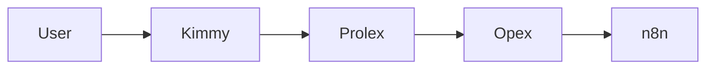
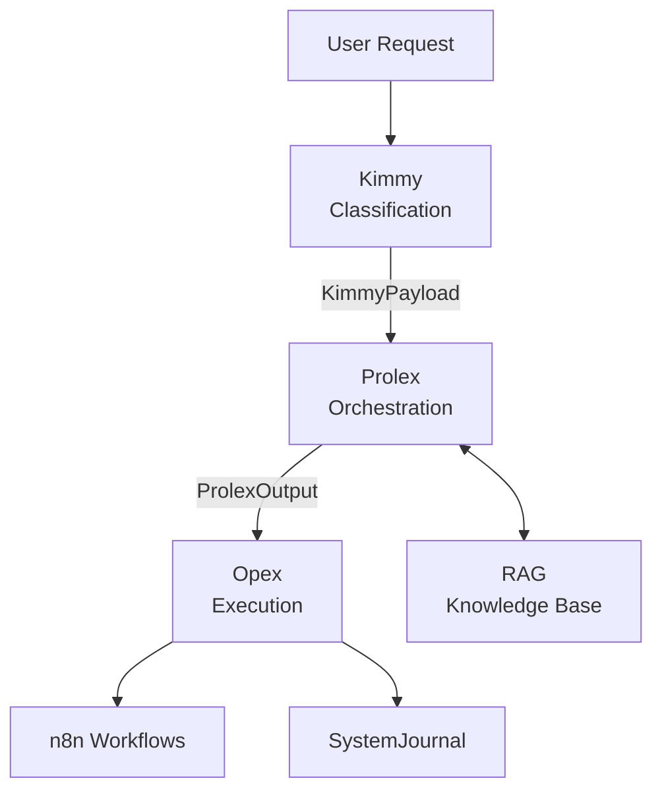

# 📖 Prolex Documentation

> **Documentation technique publique complète pour Prolex**
> **Repository**: `ProlexAi/prolex-docs`
> **Visibilité**: 🔓 PUBLIC
> **Site**: https://docs.prolex.ai (GitHub Pages)

---

## 🎯 Vue d'ensemble

**Prolex Docs** est la documentation technique publique:
- Getting started guides
- Architecture system
- API references
- Workflow tutorials
- Development guides
- Deployment guides

**Générateur**: MkDocs (Material theme) ou Docusaurus

---

## 🎭 Rôle et responsabilités

### Responsabilités principales

1. **Documentation technique**: Guides complets
2. **API Reference**: Documentation auto-générée
3. **Tutoriels**: Step-by-step guides
4. **Examples**: Code examples et use cases
5. **Site statique**: Déploiement GitHub Pages

---

## 🧠 Pour les IA développeurs

### Quoi coder ici

- [x] **Documentation** (`docs/`)
  - Getting Started
  - Architecture
  - Guides (workflows, tools, MCP)
  - API Reference
  - Development guides
  - Deployment guides

- [x] **Blog technique** (`blog/`)
  - Release notes
  - Tutorials
  - Best practices

- [x] **Site config** (`mkdocs.yml` ou `docusaurus.config.js`)
  - Navigation
  - Theme customization
  - Plugins

### Où coder

```
docs/
├── index.md                     # Homepage
│
├── getting-started/
│   ├── introduction.md
│   ├── installation.md
│   ├── quick-start.md
│   └── first-workflow.md
│
├── architecture/
│   ├── overview.md              # Architecture globale
│   ├── kimmy.md                 # Kimmy (filtre)
│   ├── prolex.md                # Prolex (orchestrateur)
│   ├── opex.md                  # Opex (exécution)
│   ├── mcp-servers.md           # MCP servers
│   ├── rag.md                   # RAG system
│   └── data-flow.md             # Flux de données
│
├── guides/
│   ├── creating-workflows.md    # Créer workflows n8n
│   ├── adding-tools.md          # Ajouter outils Prolex
│   ├── autonomy-levels.md       # Niveaux autonomie
│   ├── mcp-integration.md       # Intégrer MCP servers
│   ├── customization.md         # Customization Prolex
│   └── troubleshooting.md       # Dépannage
│
├── api-reference/
│   ├── core-api.md              # Prolex Core API
│   ├── kimmy-api.md             # Kimmy API
│   ├── opex-api.md              # Opex API
│   ├── rag-api.md               # RAG API
│   └── mcp-apis.md              # MCP APIs
│
├── workflows/
│   ├── catalog.md               # Catalogue complet
│   ├── conventions.md           # Conventions nommage
│   └── examples/
│       ├── task-automation.md
│       ├── client-onboarding.md
│       └── monitoring.md
│
├── development/
│   ├── contributing.md          # Guide contribution
│   ├── code-style.md            # Style guide
│   ├── testing.md               # Testing strategy
│   ├── ci-cd.md                 # CI/CD workflows
│   └── local-setup.md           # Setup local dev
│
└── deployment/
    ├── local-setup.md           # Setup local
    ├── staging.md               # Deploy staging
    ├── production.md            # Deploy production
    ├── docker.md                # Docker deployment
    └── kubernetes.md            # K8s deployment (future)

blog/
├── 2025-11-24-prolex-v4-release.md
├── 2025-11-20-autonomous-workflows.md
└── 2025-11-15-mcp-integration.md

static/
├── images/
│   ├── architecture/
│   ├── screenshots/
│   └── logos/
├── diagrams/
│   └── mermaid/
└── videos/

mkdocs.yml                       # MkDocs config
# OU
docusaurus.config.js             # Docusaurus config
```

### Comment coder

**MkDocs (Material theme)**:
```yaml
# mkdocs.yml
site_name: Prolex Documentation
site_url: https://docs.prolex.ai
repo_url: https://github.com/ProlexAi/prolex-docs

theme:
  name: material
  palette:
    primary: indigo
    accent: blue
  features:
    - navigation.tabs
    - navigation.instant
    - search.highlight

plugins:
  - search
  - mermaid2

nav:
  - Home: index.md
  - Getting Started:
      - Introduction: getting-started/introduction.md
      - Installation: getting-started/installation.md
  - Architecture:
      - Overview: architecture/overview.md
  # ...
```

**Diagrammes Mermaid**:
```markdown
# Architecture


```

---

## 📋 Sections principales

### 1. Getting Started

**Audience**: Nouveaux utilisateurs Prolex

**Contenu**:
- Introduction à Prolex
- Installation (local + cloud)
- Quick start (premier workflow)
- Concepts clés
- FAQ

---

### 2. Architecture

**Audience**: Développeurs, architectes

**Contenu**:
- Architecture globale (3 tiers: Kimmy → Prolex → Opex)
- Détails techniques chaque composant
- Flux de données
- Schémas d'architecture
- Décisions d'architecture

**Diagrammes**:


---

### 3. Guides

**Audience**: Utilisateurs avancés, développeurs

**Contenu**:
- **Creating Workflows**: Step-by-step création workflow n8n
- **Adding Tools**: Ajouter nouveau tool à Prolex
- **Autonomy Levels**: Comprendre et configurer niveaux 0-3
- **MCP Integration**: Créer serveur MCP
- **Customization**: Personnaliser Prolex
- **Troubleshooting**: Résoudre problèmes communs

**Exemple structure guide**:
```markdown
# Creating Workflows

## Introduction
Prolex peut créer et gérer des workflows n8n autonomes...

## Prerequisites
- n8n installé
- Prolex Core configuré
- Autonomy level >= 2

## Step-by-Step

### 1. Design workflow
...

### 2. Export JSON
...

### 3. Add to repository
...

## Best Practices
- Nommage convention
- Error handling
- Logging

## Common Issues
- Workflow not syncing
- Validation errors
```

---

### 4. API Reference

**Audience**: Développeurs intégrant Prolex

**Contenu**:
- **Prolex Core API**: Endpoints, authentification, exemples
- **Kimmy API**: Classification, intents
- **Opex API**: Workflow execution
- **RAG API**: Query knowledge base
- **MCP APIs**: MCP servers documentation

**Format OpenAPI 3.0**:
```yaml
openapi: 3.0.0
info:
  title: Prolex Core API
  version: 4.0.0

paths:
  /api/v1/process:
    post:
      summary: Process KimmyPayload
      requestBody:
        content:
          application/json:
            schema:
              $ref: '#/components/schemas/KimmyPayload'
      responses:
        '200':
          description: Success
          content:
            application/json:
              schema:
                $ref: '#/components/schemas/ProlexOutput'
```

---

### 5. Workflows

**Audience**: Utilisateurs, développeurs workflows

**Contenu**:
- **Catalog**: Liste complète 30+ workflows
- **Conventions**: Naming, structure, best practices
- **Examples**: Tutorials workflows par catégorie

---

### 6. Development

**Audience**: Contributeurs, développeurs core

**Contenu**:
- **Contributing Guide**: Comment contribuer
- **Code Style**: Style guide (TypeScript, Python)
- **Testing**: Strategy tests, coverage
- **CI/CD**: GitHub Actions workflows
- **Local Setup**: Environment dev local

---

### 7. Deployment

**Audience**: DevOps, administrateurs

**Contenu**:
- **Local**: Setup avec Docker Compose
- **Staging**: Deploy environnement staging
- **Production**: Deploy production complet
- **Docker**: Containers et orchestration
- **Kubernetes**: K8s deployment (future)

---

## 🚀 Build & Deploy

### Local development

```bash
# Clone
git clone git@github.com:ProlexAi/prolex-docs.git
cd prolex-docs

# Install MkDocs
pip install mkdocs-material

# Serve locally
mkdocs serve

# Open http://localhost:8000
```

---

### Build static site

```bash
# Build
mkdocs build

# Output in site/
```

---

### Deploy GitHub Pages

```bash
# Deploy to gh-pages branch
mkdocs gh-deploy

# Accessible at https://docs.prolex.ai
```

---

### CI/CD (GitHub Actions)

`.github/workflows/deploy-docs.yml`:
```yaml
name: Deploy Docs

on:
  push:
    branches: [main]

jobs:
  deploy:
    runs-on: ubuntu-latest
    steps:
      - uses: actions/checkout@v3

      - name: Setup Python
        uses: actions/setup-python@v4
        with:
          python-version: '3.x'

      - name: Install dependencies
        run: pip install mkdocs-material

      - name: Build docs
        run: mkdocs build

      - name: Deploy to GitHub Pages
        uses: peaceiris/actions-gh-pages@v3
        with:
          github_token: ${{ secrets.GITHUB_TOKEN }}
          publish_dir: ./site
```

---

## ✍️ Contribution

### Ajouter documentation

```bash
# 1. Créer branche
git checkout -b docs/new-guide

# 2. Ajouter/modifier MD
vim docs/guides/my-new-guide.md

# 3. Tester local
mkdocs serve

# 4. Commit + push
git add docs/guides/my-new-guide.md
git commit -m "docs: add new guide for X"
git push

# 5. Create PR
gh pr create
```

---

### Style guide documentation

- **Ton**: Clair, concis, technique
- **Headers**: H1 pour titre, H2 pour sections principales
- **Code blocks**: Toujours spécifier langage
- **Links**: Relative paths pour liens internes
- **Images**: Stocker dans `static/images/`
- **Diagrammes**: Utiliser Mermaid quand possible

---

## 🔍 Search

**MkDocs Search** intégré:
- Index automatique de toute la doc
- Search box en header
- Highlighting résultats

---

## 📊 Analytics (optionnel)

**Google Analytics**:
```yaml
# mkdocs.yml
extra:
  analytics:
    provider: google
    property: G-XXXXXXXXXX
```

---

## 🌐 Multilingual (future)

Support multilingue avec `mkdocs-static-i18n`:
```yaml
plugins:
  - i18n:
      default_language: fr
      languages:
        fr:
          name: Français
        en:
          name: English
```

---

## 📚 Documentation complète

- [MkDocs](https://www.mkdocs.org/)
- [Material for MkDocs](https://squidfunk.github.io/mkdocs-material/)
- [Mermaid](https://mermaid.js.org/)

---

## 📄 License

MIT License - Documentation publique

---

## 🔗 Liens

- **Site**: https://docs.prolex.ai
- **GitHub**: https://github.com/ProlexAi/prolex-docs
- **Main Repo**: https://github.com/ProlexAi/Prolex
